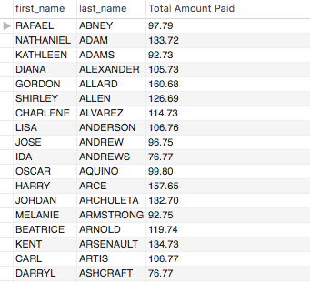

## Homework Assignment

* 1a. Display the first and last names of all actors from the table `actor`. 

```sql
select first_name, last_name from actor;
```

* 1b. Display the first and last name of each actor in a single column in upper case letters. Name the column `Actor Name`. 

```sql
select upper(concat(first_name,' ',last_name)) as 'Actor Name' from actor;
```

* 2a. You need to find the ID number, first name, and last name of an actor, of whom you know only the first name, "Joe." What is one query would you use to obtain this information?

```sql
select actor_id, first_name, last_name from actor where first_name = 'Joe';
```

* 2b. Find all actors whose last name contain the letters `GEN`:

```sql
select first_name, last_name from actor where last_name like '%GEN%';
```

* 2c. Find all actors whose last names contain the letters `LI`. This time, order the rows by last name and first name, in that order:

```sql
select first_name, last_name from actor where last_name like '%LI%' order by last_name, first_name;
```

* 2d. Using `IN`, display the `country_id` and `country` columns of the following countries: Afghanistan, Bangladesh, and China:

```sql
select country_id, country from country where country in ('Afghanistan', 'Bangladesh', 'China');
```

* 3a. Add a `middle_name` column to the table `actor`. Position it between `first_name` and `last_name`. Hint: you will need to specify the data type.

```sql
alter table actor
add column middle_name varchar(30) after first_name;
```

* 3b. You realize that some of these actors have tremendously long last names. Change the data type of the `middle_name` column to `blobs`.

```sql
alter table actor
modify column middle_name blob;
```

* 3c. Now delete the `middle_name` column.

```sql
alter table actor
drop column middle_name;
```

* 4a. List the last names of actors, as well as how many actors have that last name.

```sql
select last_name, count(last_name) from actor group by last_name;
```

* 4b. List last names of actors and the number of actors who have that last name, but only for names that are shared by at least two actors

```sql
select last_name, count(last_name) as 'Count of Last Name' from actor  group by last_name having count(last_name) > 2;
```

* 4c. Oh, no! The actor `HARPO WILLIAMS` was accidentally entered in the `actor` table as `GROUCHO WILLIAMS`, the name of Harpo's second cousin's husband's yoga teacher. Write a query to fix the record.

```sql
update actor set first_name = 'HARPO' where first_name = 'GROUCHO' and last_name = 'WILLIAMS';
```

* 4d. Perhaps we were too hasty in changing `GROUCHO` to `HARPO`. It turns out that `GROUCHO` was the correct name after all! In a single query, if the first name of the actor is currently `HARPO`, change it to `GROUCHO`. Otherwise, change the first name to `MUCHO GROUCHO`, as that is exactly what the actor will be with the grievous error. BE CAREFUL NOT TO CHANGE THE FIRST NAME OF EVERY ACTOR TO `MUCHO GROUCHO`, HOWEVER! (Hint: update the record using a unique identifier.)

```sql
update actor set first_name = 
CASE
when (actor_id = 172 and first_name = 'HARPO') then 'GROUCHO'
when (actor_id = 172 and first_name <> 'HARPO') then 'MUCHO GROUCHO'
ELSE
first_name
END;
```

* 5a. You cannot locate the schema of the `address` table. Which query would you use to re-create it? 

  * Hint: [https://dev.mysql.com/doc/refman/5.7/en/show-create-table.html](https://dev.mysql.com/doc/refman/5.7/en/show-create-table.html)

  ```sql
  show create table address;
  ```

* 6a. Use `JOIN` to display the first and last names, as well as the address, of each staff member. Use the tables `staff` and `address`:

```sql
select s.first_name, s.last_name, coalesce(a.address, 'No Address Found in Table') as 'address'
from
staff s
join
address a
on s.address_id = a.address_id;
```

* 6b. Use `JOIN` to display the total amount rung up by each staff member in August of 2005. Use tables `staff` and `payment`.

```sql
select s.staff_id, s.first_name, s.last_name,  coalesce(concat('$', format(sum(p.amount), 2)), '$0') as amount 
from
staff s
join
payment p
on
s.staff_id = p.staff_id
where
p.payment_date >= '2005-08-01 00:00:00'
and
p.payment_date <   '2005-08-02 00:00:00'
group by s.staff_id;
```

* 6c. List each film and the number of actors who are listed for that film. Use tables `film_actor` and `film`. Use inner join.

```sql
select f.title, count(fa.actor_id) as 'Number of Actors'
from
film f
inner join
film_actor fa
on f.film_id = fa.film_id
group by f.title;
```

* 6d. How many copies of the film `Hunchback Impossible` exist in the inventory system?

```sql
select f.title, count(i.film_id) as 'Number of Copies'
from
film f
inner join
inventory i
on
f.film_id = i.film_id
group by f.title
having f.title = 'Hunchback Impossible';
```

* 6e. Using the tables `payment` and `customer` and the `JOIN` command, list the total paid by each customer. List the customers alphabetically by last name:



```sql
select c.first_name, c.last_name, sum(coalesce(p.amount, 0))
from customer c
join
payment p
on c.customer_id = p.customer_id
group by c.first_name, c.last_name
order by c.last_name asc;
```

* 7a. The music of Queen and Kris Kristofferson have seen an unlikely resurgence. As an unintended consequence, films starting with the letters `K` and `Q` have also soared in popularity. Use subqueries to display the titles of movies starting with the letters `K` and `Q` whose language is English. 

```sql
select f.title
from film f 
where
f.language_id in
(select l.language_id from language l where name = 'English')
and
f.title rlike '^[K,Q]';
```

* 7b. Use subqueries to display all actors who appear in the film `Alone Trip`.

```sql
select a.first_name, a.last_name 
from actor a
where
a.actor_id in
(select fa.actor_id from film_actor fa
 where fa.film_id = 
 (select f.film_id from film f where title = 'Alone Trip'));
 ```

* 7c. You want to run an email marketing campaign in Canada, for which you will need the names and email addresses of all Canadian customers. Use joins to retrieve this information.

```sql
select cust.first_name
      ,cust.last_name
      ,coalesce(cust.email, 'No Email Available') as 'Email'
from
customer cust
inner join
address a
on cust.address_id = a.address_id
inner join
city
on a.city_id = city.city_id
inner join
country
on city.country_id = country.country_id
where
country.country = 'Canada';
```

* 7d. Sales have been lagging among young families, and you wish to target all family movies for a promotion. Identify all movies categorized as famiy films.

```sql
select f.title
from film f
inner join
film_category fc
on
f.film_id = fc.film_id
inner join
category c
on
fc.category_id = c.category_id
where
c.name = 'Family';
```

* 7e. Display the most frequently rented movies in descending order.

```sql
select f.title, count(r.rental_id) as 'Number of Rentals'
from 
film f
inner join
inventory i
on f.film_id = i.film_id
inner join 
rental r
on r.inventory_id = i.inventory_id
group by f.title
order by count(r.rental_id) desc;
```

* 7f. Write a query to display how much business, in dollars, each store brought in.

```sql
select  s.store_id
       ,coalesce(concat('$', format(sum(p.amount), 2)), '$0') as amount
from
store s
inner join
staff
on s.store_id = staff.store_id
inner join
payment p
on staff.staff_id = p.staff_id
group by s.store_id;
```

* 7g. Write a query to display for each store its store ID, city, and country.

```sql
select s.store_id
      ,city.city
      ,cntry.country
from
store s
inner join
address a
on s.address_id = a.address_id
inner join
city 
on
city.city_id = a.city_id
inner join
country cntry
on
city.country_id = cntry.country_id;
```

* 7h. List the top five genres in gross revenue in descending order. (**Hint**: you may need to use the following tables: category, film_category, inventory, payment, and rental.)

```sql
select catg.name
          ,coalesce(concat('$', format(sum(p.amount), 2)), '$0') as 'Gross Revenue'
from
category catg
inner join
film_category fc
on catg.category_id = fc.category_id
inner join
inventory i
on fc.film_id = i.film_id
inner join
rental r
on i.inventory_id = r.inventory_id
inner join 
payment p
on r.rental_id = p.rental_id
group by catg.name
order by coalesce(concat('$', format(sum(p.amount), 2)), '$0') desc
limit 5;
```

* 8a. In your new role as an executive, you would like to have an easy way of viewing the Top five genres by gross revenue. Use the solution from the problem above to create a view. If you haven't solved 7h, you can substitute another query to create a view.

```sql
create view top_five_genres as
select catg.name
          ,coalesce(concat('$', format(sum(p.amount), 2)), '$0') as 'Gross Revenue'
from
category catg
inner join
film_category fc
on catg.category_id = fc.category_id
inner join
inventory i
on fc.film_id = i.film_id
inner join
rental r
on i.inventory_id = r.inventory_id
inner join 
payment p
on r.rental_id = p.rental_id
group by catg.name
order by coalesce(concat('$', format(sum(p.amount), 2)), '$0') desc
limit 5;
```

* 8b. How would you display the view that you created in 8a?

```sql
select * from top_five_genres;
```

* 8c. You find that you no longer need the view `top_five_genres`. Write a query to delete it.

```sql
drop view top_five_genres;
```

### Appendix: List of Tables in the Sakila DB

* A schema is also available as `sakila_schema.svg`. Open it with a browser to view.

```sql
	'actor'
	'actor_info'
	'address'
	'category'
	'city'
	'country'
	'customer'
	'customer_list'
	'film'
	'film_actor'
	'film_category'
	'film_list'
	'film_text'
	'inventory'
	'language'
	'nicer_but_slower_film_list'
	'payment'
	'rental'
	'sales_by_film_category'
	'sales_by_store'
	'staff'
	'staff_list'
	'store'
```
